<!--
  Zazen AI Studio — GitHub Profile README
  Expanded edition built around the approved V4 top section and project README facts.
-->

  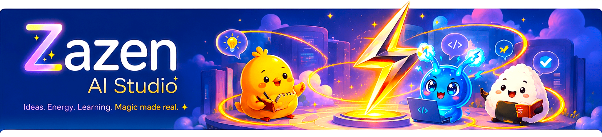

<!-- Main showcase row: About + 3 product cards -->

  
  <a href="https://github.com/zazenaistudio/chibi-notes-windows">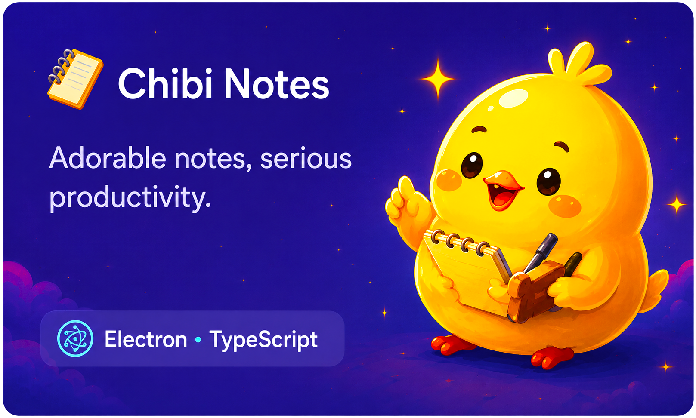</a>
  <a href="https://github.com/zazenaistudio/bolty-switch-windows">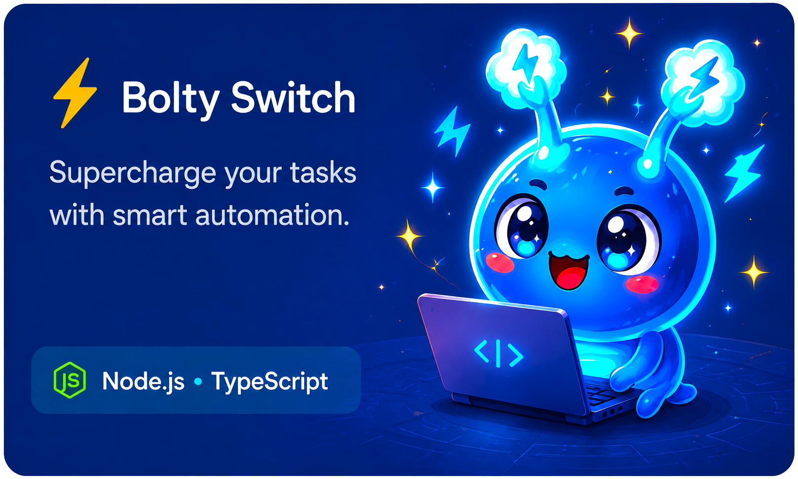</a>
  

  
  
  

  

---

## ✨ Studio ecosystem

**Zazen AI Studio** combines software engineering, playful visual design and local-first experiences. The current public ecosystem is built around three projects with different personalities but the same goal: making useful software feel more creative, approachable and memorable.

  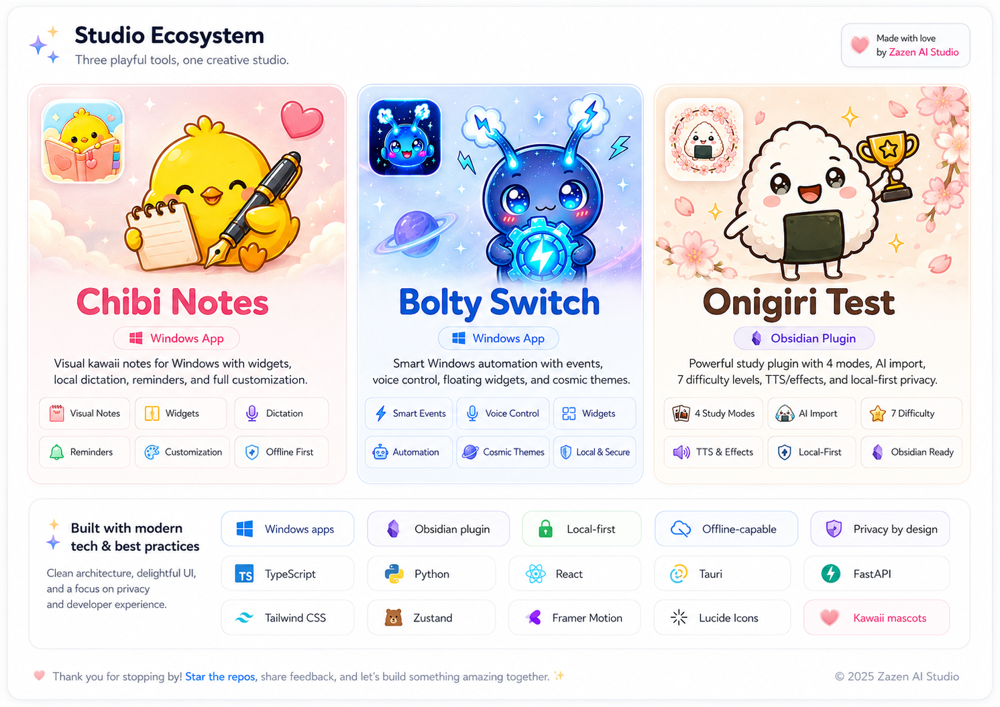

> **Visual direction board:** the illustration above is a creative overview. The technical details and project capabilities listed below are taken from the projects themselves.

  
  
  

---

# 🐥 Chibi Notes

  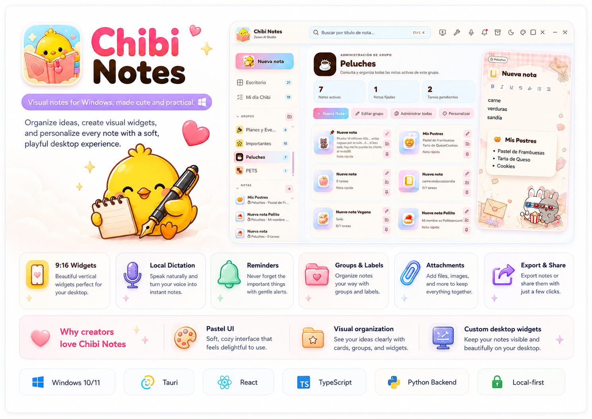

**Chibi Notes** is a visual kawaii note manager for **Windows 10/11**. It combines a complete note dashboard with independent **9:16 desktop widgets**, local voice dictation, reminders, attachments, export tools and extensive visual customization.

<table>
<tr>
<td width="50%" valign="top">

### 🌸 Highlights

- 📝 Rich visual notes, checklists and tasks.
- 🗂️ Groups, categories, labels and pinned notes.
- 📱 Independent 9:16 note widgets.
- 🎨 Backgrounds, mascots, frames, colors and typography.
- 🎙️ Local Spanish/English dictation with Vosk.

</td>
<td width="50%" valign="top">

### 🧰 Productivity & privacy

- 🔔 Native Windows reminders.
- 📎 Files, images and web links.
- 📤 TXT, PDF, Markdown and JSON export.
- 🔒 Local SQLite storage and note protection.
- 👤 No account required for core use.

</td>
</tr>
</table>

  
  
  
  
  
  

  <a href="https://github.com/zazenaistudio/chibi-notes-windows"><strong>🌸 Explore Chibi Notes →</strong></a>

<strong>🖼️ Open the official promotional artwork</strong>

 

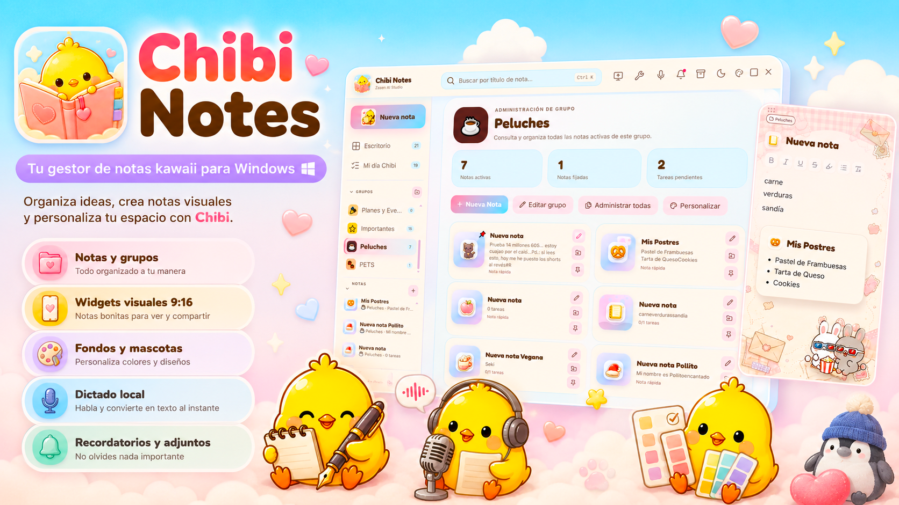

---

# ⚡ Bolty Switch

  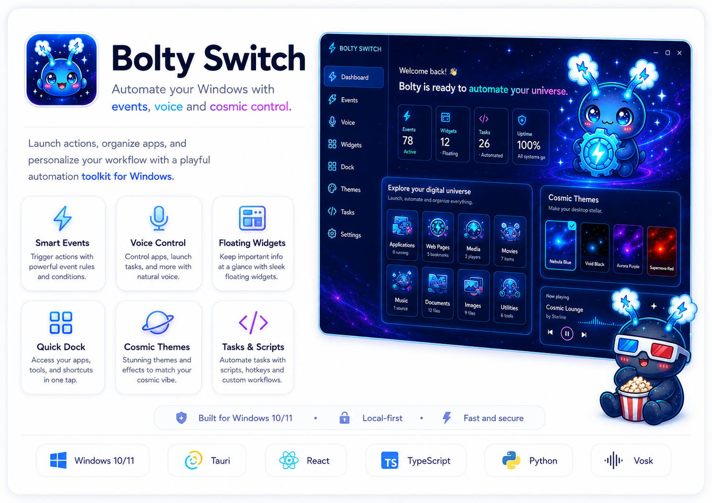

**Bolty Switch** is a Windows automation application that turns the desktop into a visual control center. It organizes apps, websites, media, files, tasks and scripts, and lets the user trigger actions through **click, text and voice**.

<table>
<tr>
<td width="50%" valign="top">

### 🌌 Smart automation

- ⚡ Event-driven actions and shortcuts.
- 🗂️ Visual library for apps, web pages and content.
- 🎙️ Text and voice commands with autocomplete.
- 🗣️ Hands-free activation using the word **“Bolty”**.
- 🧩 Floating execution and microphone widgets.

</td>
<td width="50%" valign="top">

### 🪐 Cosmic desktop experience

- 📌 Quick dock for pinned events.
- 🧾 Scripts and Windows system tasks.
- 🎨 Cosmic themes, animated palettes and holographic borders.
- 💾 Local persistence with SQLite.
- 🔐 Personal-use focused distribution under the Zazen AI Studio license.

</td>
</tr>
</table>

  
  
  
  
  
  

  <a href="https://github.com/zazenaistudio/bolty-switch-windows"><strong>⚡ Explore Bolty Switch →</strong></a>

<strong>🖼️ Open the official promotional artwork</strong>

 

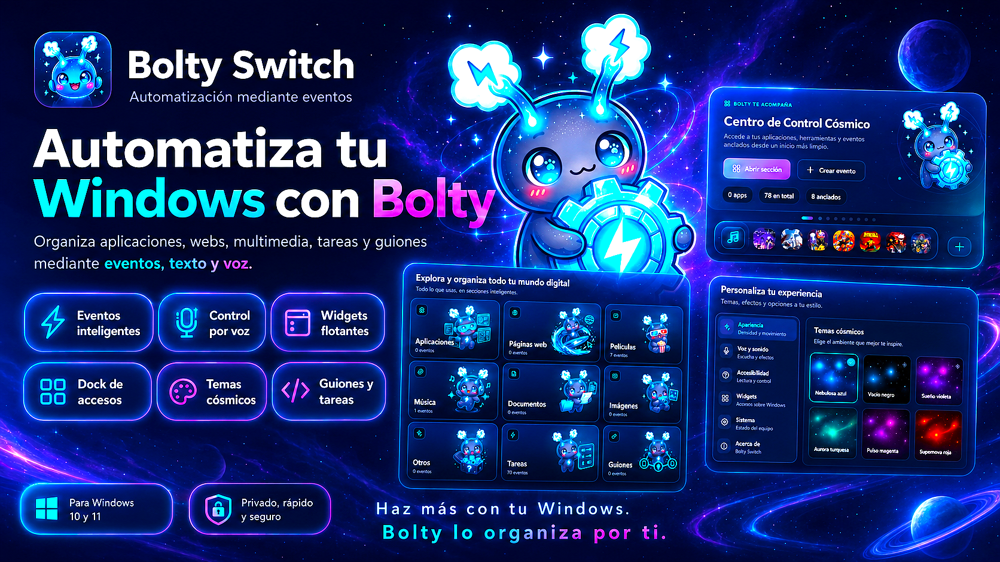

---

# 🍙 Onigiri Test

  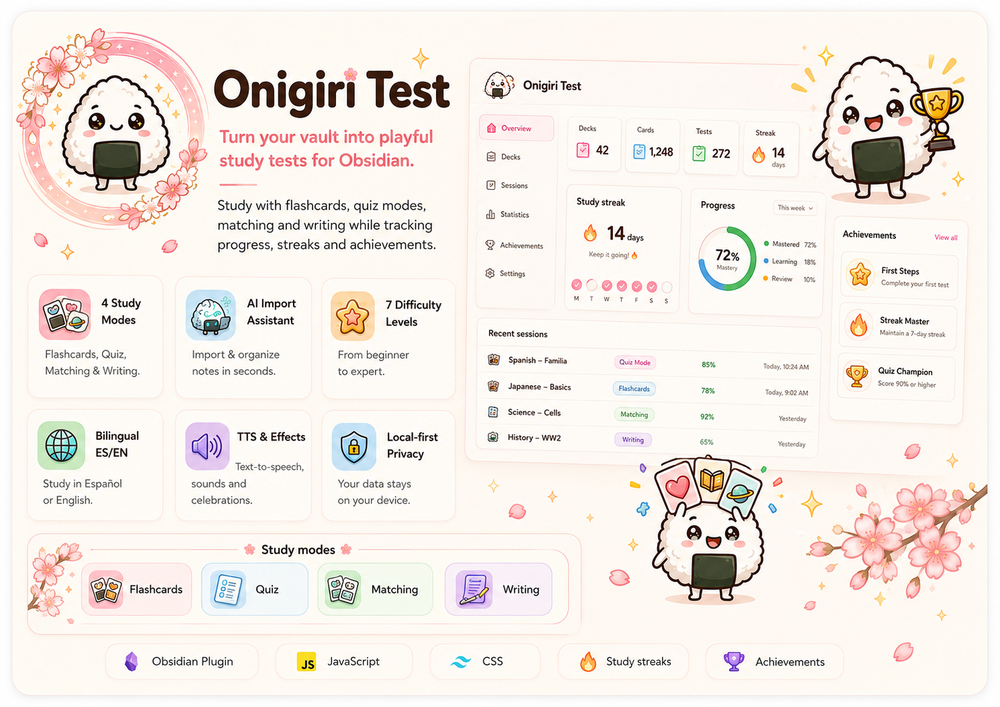

**Onigiri Test** is a kawaii study plugin for **Obsidian Desktop**. It transforms Markdown notes into an organized test library while preserving the relationship between folders, files and study content.

<table>
<tr>
<td width="50%" valign="top">

### 🎴 Study system

- 💗 Flashcards.
- 💙 Multiple-choice questions.
- 💚 Matching.
- 💜 Exact writing.
- ⭐ Seven difficulty levels with repeated study cycles.

</td>
<td width="50%" valign="top">

### 🌸 Learning experience

- 🤖 Guided AI import workflow for ZIP/JSON study packages.
- 🔥 Daily streaks, weekly progress and session history.
- 🌍 Full Spanish / English interface.
- 🔊 Optional system TTS, music, sounds and animations.
- 🔐 Local-first library and progress storage.

</td>
</tr>
</table>

  
  
  
  
  

  <a href="https://github.com/zazenaistudio/onigiri-test-original"><strong>🍙 Explore Onigiri Test →</strong></a>

<strong>🖼️ Open the official promotional artwork</strong>

 

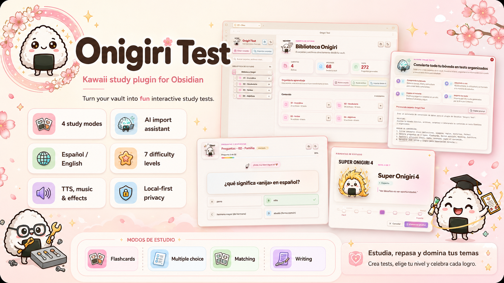

---

## 🧠 How we build

The studio workflow is built around a simple loop: **idea → design → code → AI-assisted iteration → experience**. The implementation varies by project, but the same principles repeat throughout the ecosystem: useful software first, readable code, local-first thinking where appropriate, fast iteration and interfaces with a clear personality.

  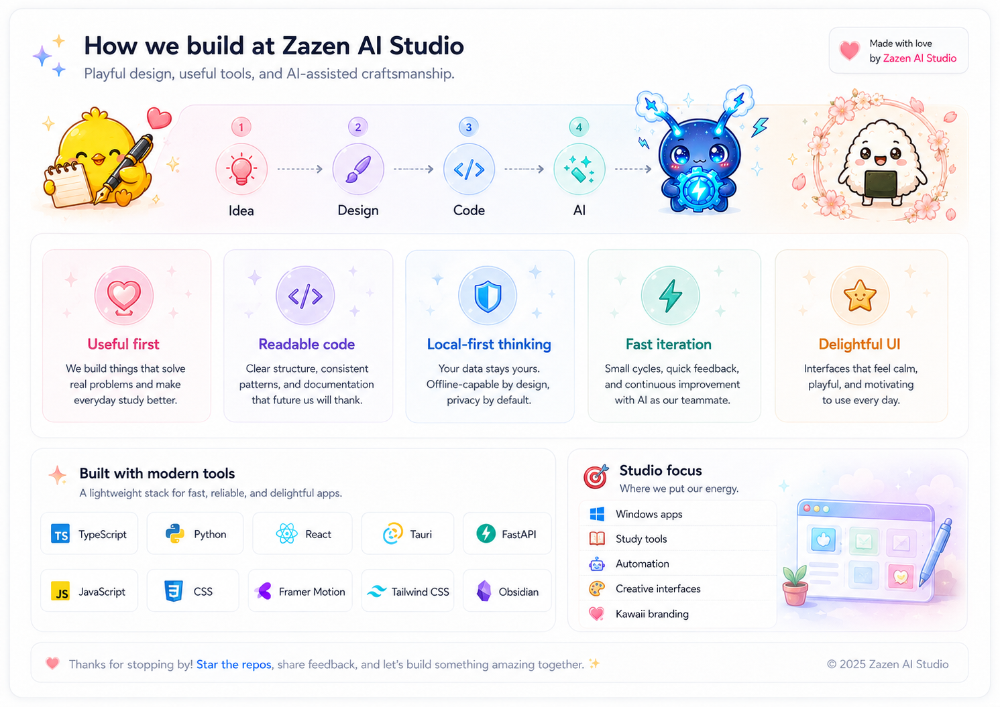

### 🛠️ Technology map

  
  
  
  
  
  
  
  

---

## 🔐 Local-first mindset

Local-first behavior is a recurring part of the studio's software design:

- **Chibi Notes** keeps notes and preferences in SQLite, supports local Vosk dictation, and does not require an account for core use.
- **Bolty Switch** stores its library and settings locally and uses Vosk for local speech recognition.
- **Onigiri Test** keeps tests, settings, streaks and results on-device; its AI assistant only provides a workflow and prompt, leaving the decision to share a vault archive to the user.

This is not a claim that every future Zazen AI Studio feature will always be offline; it is a design preference to keep user data local whenever the product can reasonably do so.

---

## 🎭 Mascots are part of the product

The mascots are not decorative stickers added at the end. They are part of the interaction language of each project: Chibi makes note-taking feel softer, Bolty gives automation a playful guide, and Onigiri turns repetition and progress into a character-driven study experience.

  
  
  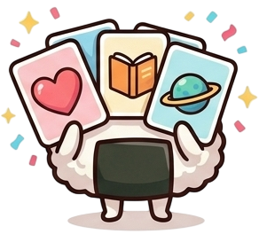
  

---

## 🌐 Projects & contact

  
  
  
  
  
  

<strong>📍 Spain</strong>

---

## 📜 Licensing

The public projects are distributed under **Zazen AI Studio** licensing terms. Their source visibility does not automatically mean open-source redistribution rights. Always check the `LICENSE` file in each repository before copying, redistributing, publishing derivative versions or reusing project artwork and mascots.

---

<strong>🎨 Visual concept boards used during this README redesign</strong>

 

These boards are included as <strong>design studies</strong>, not as authoritative technical specifications or live repository statistics.

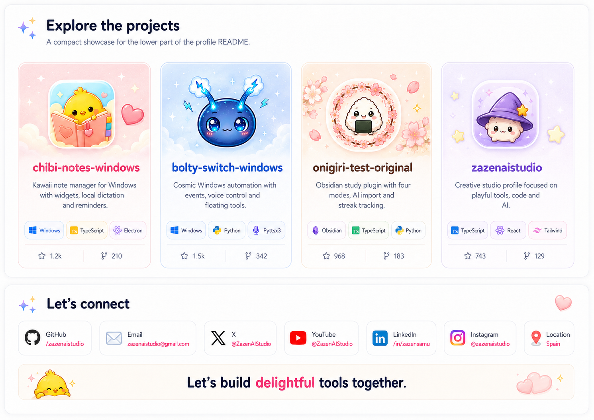

---

  <strong>⚡ Design Your Future · Coding Your Life ⚡</strong> 
  Ideas. Energy. Learning. Magic made real.  
  <a href="mailto:zazenaistudio@gmail.com">zazenaistudio@gmail.com</a>

