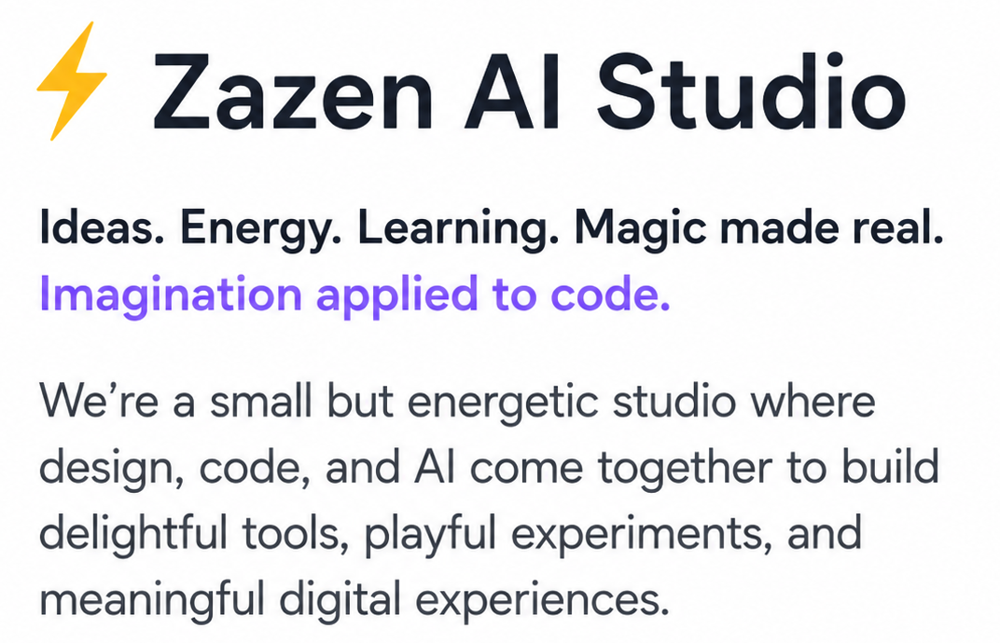
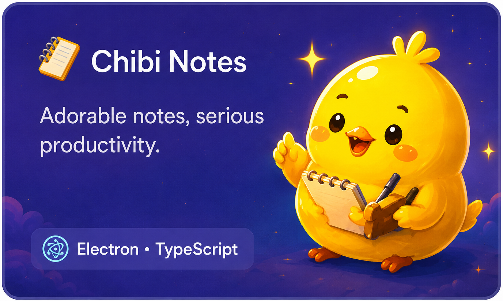
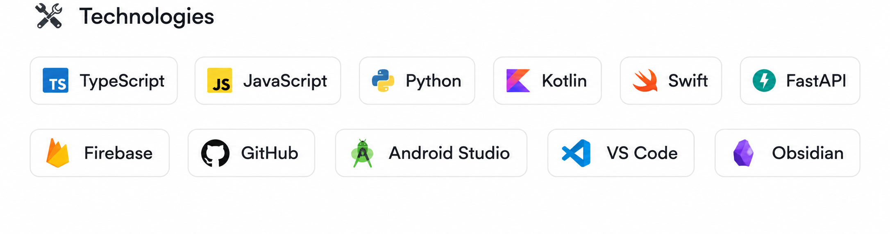
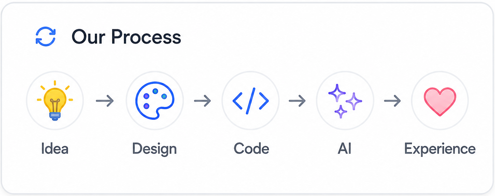
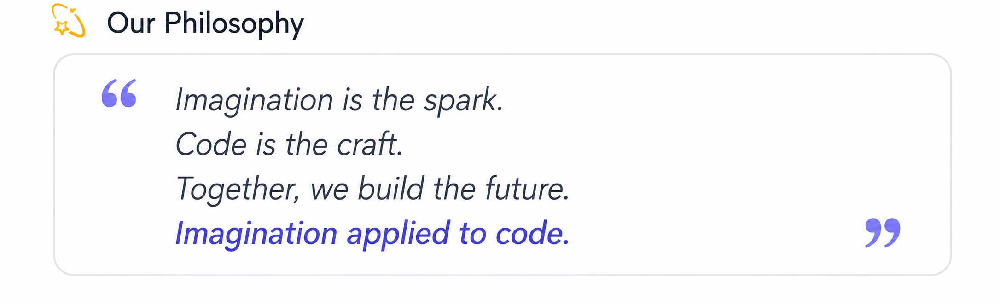

<!--
  Zazen AI Studio — GitHub Profile README v4
  Built from the exact user-cropped visual assets from the approved mockup.
  Images are intentionally kept as separate puzzle pieces so GitHub can
  recompose the layout while preserving the mockup's visual hierarchy.
-->

  

<!-- Main showcase row: About + 3 product cards -->

  
  
  
  

<!-- Studio system row: Technologies + Process + Philosophy -->

  
  
  

<!-- Compact footer from the mockup -->

  

